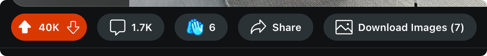

# Reddit Download Buttons

   

The browser extension that I've always wanted for Reddit... download buttons for easily saving images within posts. It's exactly what a data hoarder needs! *Does not require Reddit login.*

## Features

- Adds buttons to Reddit posts and inside galleries for easy one-click downloads
- Separate ZIP download button for downloading all images in a folder
- Supports downloading single images, entire image galleries, and GIFs
- Works on both the Reddit feed and individual post pages
- Detects the highest resolution version of images for download

>[!WARNING]
> Currently the extension doesn't work on inline videos due to some `m3u8` thing I couldn't get to work. Please feel free to help with an [issue](https://github.com/956MB/reddit-download-button/issues) or [pull request](https://github.com/956MB/reddit-download-button/pulls).

## Supported Browsers:

##### *Chromium-based*

| Browser | Last Tested Version (Chromium Engine) |
|:--------|:--------------------------------------|
| [Arc](https://arc.net/download) | 1.70.0 (131.0.6778.86) |
| [Brave](https://brave.com/download/) | 1.67.123 (126.0.6478.126) |
| [Chrome](https://www.google.com/chrome/browser-tools/) | 126.0.6478.127 (126.0.0.0) |
| [Chromium](https://download-chromium.appspot.com/) | 128.0.6580.0 (128.0.0.0) |
| [Opera](https://www.opera.com/download) | 111.0.5168.61 (125.0.6422.143) |
| [Vivaldi](https://vivaldi.com/download/) | 6.8.3381.46 (126.0.0.0) |

##### *Other*

| Browser | Requires |
|:--------|:---------|
| [Firefox](https://www.mozilla.org/en-US/firefox/all/#product-desktop-release) | 127.0.2 |
| [Safari](https://www.apple.com/safari/) | Doesn't work natively with Safari, but the [Tampermonkey®](https://www.tampermonkey.net/index.php?browser=safari&locale=en) extension (Safari v6-11) or the paid [Mac App Store version](https://apps.apple.com/us/app/tampermonkey/id1482490089) (Safari v12+) could work. I have not tested either, though. |

## Installation

*Not added to the Chrome Web store or Firefox Add-ons yet, but may be in the future.*

##### Userscript (Greasyfork/Tampermonkey):

1. Install [Tampermonkey](https://www.tampermonkey.net/) for your browser
2. Click on this link to open the script in Tampermonkey: [Reddit Download Buttons Script](https://greasyfork.org/en/scripts/501718-reddit-download-buttons)
3. Click on the "Install" or "Update" button
4. The script should now be active on Reddit

## TODO

- [ ] Figure out downloading m3u8 videos
- [ ] Add UI for extension settings
- [ ] Include metadata in ZIP file for the downloaded images/post (title, author, comments, etc.)
- [ ] Support downloading multiple inline images/videos from text posts
- [ ] Add download buttons to single images in comment sections.

## Known Issues

> [!NOTE]
- ZIP file creation not working when run from Tampermonkey. [Issue #2](https://github.com/956MB/reddit-download-button/issues/2)

## Changelog

[1.3.5](./CHANGELOG.md#135---2025-04-22) - 2025-04-22

##### Fixed

- [#7](https://github.com/956MB/reddit-download-button/issues/7) Fixed images not being downloaded at highest resolution due to incorrectly identifying the zoomable element. Downloads overall seem to be faster now with these changes (fingers crossed).
- Preview download button and others downloading from `i.redd.it` urls now uses `GM_xmlhttpRequest` (Tampermonkey only, unpacked extensions through chrome doesn't support or play nice with this) to bypass CORS.
- [#6](https://github.com/956MB/reddit-download-button/issues/6) Fixed images not having their correct extension when multiple extensions are present in the post. Like a `.gif` and a `.png`, default `.png` would be used for both.
- Not sure how or why, but maybe file previews in macOS are back to normal since we're downloading form the `i.redd.it` urls? Not even sure if this was script issue or a problem for other OS as well.

##### Removed

- Removed the installation instructions for manual "load unpacked" method. It doesn't play nice with the CORS policy of `i.redd.it` urls or the `GM_xmlhttpRequest` function used by tampermonkey. It's just not the best way to use it.
- [#2](https://github.com/956MB/reddit-download-button/issues/2) Removed the ZIP download functionality because it's broken right now and I'm not sure how to fix it. Maybe will be added back if I add UI. Reduces tampermonkey script size by ~100kb, so that's a plus. Reference to #2.

For a full list of changes and past versions, please see the [CHANGELOG.md](CHANGELOG.md)

## License

[MIT LICENSE](./LICENSE)